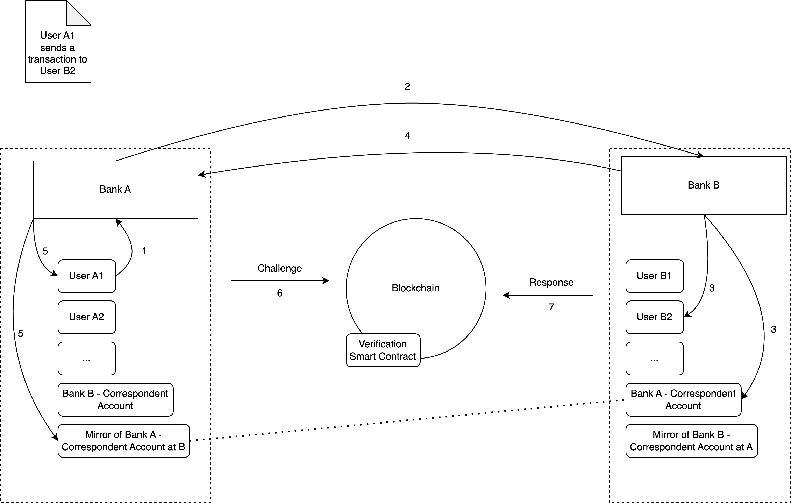

# How it works - Comprehensive explanation

Running the program launches an instance of a "bank". It is a simple command line program, and the diagnostic output is simply printed out on the console. User can issue commands through the interactive prompt interface to create and manage accounts, send transactions between different customers, etc. Color coding is used to disitinguish between different pieces of information.

Each bank has a database holding its customer accounts. An account is defined by the following fields:

```
Iban      string
Holder    string
Balance   float32 
Currency  string
Bic       string
Suspended bool
```

There is a special type of account, Correspondent Account, which holds the prefunded balance of a bank at another bank. Each bank keeps a mirror in its records of its Correspondent Accounts at the counterpart banks. These accounts are visualized in red and green colors, respectively.


It is important that the state of these special accounts is kept in sync among different banks' private records. For this purpose, every certain amount of time, banks perform a consistency check by publishing a commitment to their state on blockchain, using a challenge - response scheme. It does not reveal information about their state to other participants.

More specifically, a bank hashes the state of the mirror of its Correspondent Account at other bank. This outputs a digest that does not reveal information about the state itself. Then it hashes the digest, and submits it as a challenge to the network. Its peer bank is expected to submit the preimage of this challenge, something that can only be accomplished by having performed the same calculations as the original bank, given the 1-way nature of hash functions.

> **Note:** the reader not familiarized with hash functions might want to play with some online tool like [Keccak256 Hash Online](https://emn178.github.io/online-tools/keccak_256.html). For every input, a different, constant-size, randomly-looking string is outputted (often called *digest*). It is unfeasible to come up with an input that hashes to a provided output.


This periodic polling and submitting information to blockchain is shown in white and light blue color logs in the program.

### Intra-bank transaction
Intra-bank transactions move assets from one client account to another within the same bank, thus not having to interact with different banks.

### Inter-bank transaction
Inter-bank transactions move assets between client accounts at different banks. This requires the originator bank to send an off-chain message to the recipient bank. The recipient bank transfers the requested amount from sending bank Correspondent Account to the final destination customer (this is an internal transfer). The recipient bank sends a confirmation of this operation. Upon receiving the confirmation the originator bank updates its mirror account accordignly.

The format of the Inter-bank transaction message is similar to Swift message MT103:
```
TxReferenceNumber      string
TimeIndication         string
BankOperationCode      string
ValueDate              string
Currency               string
ExchangeRate           string
OrderingInstitution    string
BeneficiaryInstitution string

OrderingCustomer    string
BeneficiaryCustomer string
Amount              string

ReferenceBlockNumber int
```

#### Complete proccess diagram


---

### Current Deployment

In the current deployment, we are using the new Ethereum test network, [Holesky](https://holesky.etherscan.io/). Our verifier [contract](https://github.com/san-lab/immudb-tests/blockchainconnector/onchainverifier.sol) is deployed in the blockchain address `0x5a0F1c0A4482a6CE88C190dE396d154A2149544a`. The transaction related to the contract can be inspected with the public blockchain [explorer](https://holesky.etherscan.io/) ([Link to contract](https://holesky.etherscan.io/address/0x5a0F1c0A4482a6CE88C190dE396d154A2149544a)).

The sample bank blockchain addresses are the following:

Bank  | Address
------------- | -------------
Santa Bank | [0x7eC027cF7f470983030167d2FACE94745E1AFfE3](https://holesky.etherscan.io/address/0x7eC027cF7f470983030167d2FACE94745E1AFfE3)
Blue Bank | [0x6e7786c888Fe08E9360E830bC5806eca6186fB89](https://holesky.etherscan.io/address/0x6e7786c888Fe08E9360E830bC5806eca6186fB89)
Green Bank | [0x3e2a6b7E74447bC16c10E1a5E5da7D1af5e5c2e3](https://holesky.etherscan.io/address/0x3e2a6b7E74447bC16c10E1a5E5da7D1af5e5c2e3)

These account have been prefunded with some Ethereum test tokens for the network gas fees. The corresponding private keys are configured in the deployed environment.

